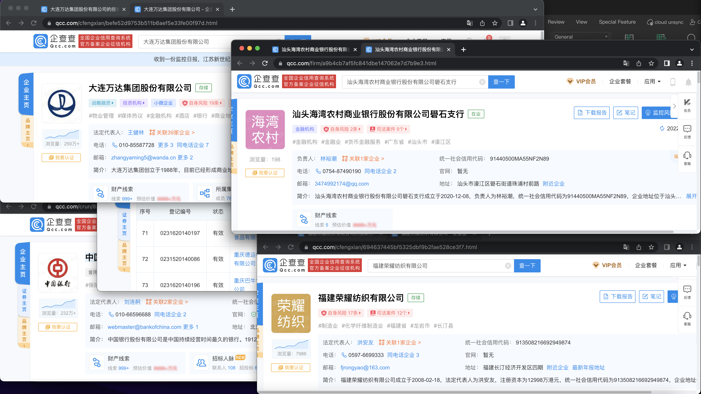
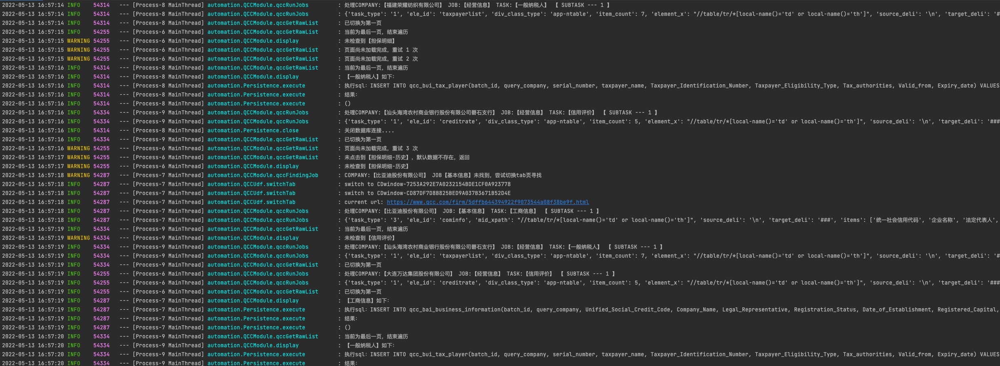
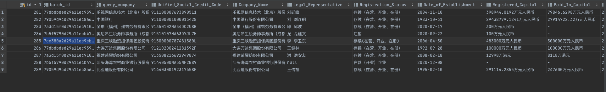
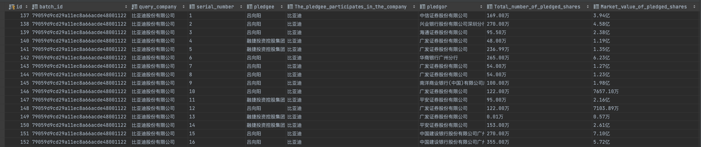
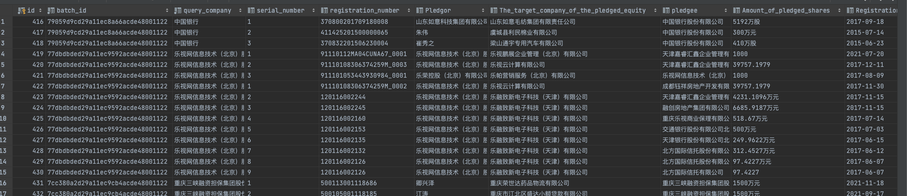

#####

# 综述
    基于selenium的qcc数据信息获取，仅供学习交流，无任何商业用途
    本项目暂时不提供源码

# 框架

> * plyer
> * pyobjus
> * future~=0.18.2
> * selenium~=3.3.1
> * pyautogui~=0.9.53
> * pymysql~=1.0.2
> * numba~=0.53.1

# 目标
- [x] **并发执行**
- [x] **配置化采集**
- [x] **数据持久化**
- [x] **日志体系**
- [ ] **自动验证**

# 功能说明

[并发执行](#d-1采集画面)
 * 根据配置的端口，进行任务分配，启动独立的浏览器和采集任务
 * 经测试，不支持多线程，仅支持多进程

配置化采集
 * 当前支持三种类型数据模式的任务配置：[K-V](#d-3-k-v)、[单表](#d-4--)、[当前+历史表](#d-5-)
 * 配置的内容包括模块、二级模块、模式、过滤器、处理参数、写表配置
 * 支持翻页、tab切换，vip信息提示关闭
 * 失败任务重试

数据持久化
 * 当前仅支持mysql

[日志体系](#d-2)
 * 仿slf4j格式，固定输出时间、日志类型、进程号、进程名、线程名、方法名、日志信息

自动验证
 * 验证码验证
 * 滑块验证
 * 点击验证

问题
 * 分隔符模式的偶发bug，清洗后的数据不满足 字段数 = 行数 * 列数

# 效果展示

## d-1、采集画面

## d-2、日志

## d-3、基本信息-工商信息（K-V）

## d-4、经营风险-股权质押-质押明细（单表）

## d-5、经营风险-股权出质(当前+历史表)

[To the top](#)

